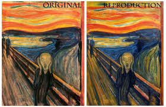

# TidyTuesday

## Personal aim

My today's goal is to have a look at plotly animations (and maybe even use them) and the ` r paletteR` package to create pallettes extracted from an image of choice.

```{r setup, include=FALSE}
# to create a rmd template
# use_tidytemplate(name = 'name.rmd', open = TRUE, refdate = 'YYYY-MM-DD')

knitr::opts_chunk$set(echo = TRUE, message = FALSE, warning = FALSE)

library(tidyverse)
library(tidytuesdayR)
library(bbplot)
library(plotly)
library(kableExtra)
library(paletteer)
library(paletter)

```

# Load the weekly Data

Download the weekly data and make available in the `tt` object.

```{r Load}

tt <- tt_load("2021-06-08")
stocked<- tt$stocked
fishing<- tt$fishing

```


# Readme

Take a look at the readme for the weekly data to get insight on the dataset.
This includes a data dictionary, source, and a link to an article on the data.

```{r Readme, eval = interactive()}

tt

```


# Glimpse Data

Take an initial look at the format of the data available.

```{r Glimpse}

stocked %>% 
  summary()

fishing %>%
   summary()

# quite few missing values in both datasets

```

# Wrangle

Explore the data and process it into a nice format for plotting! Access each dataset by name by using a dollarsign after the `tt` object and then the name of the data set.

```{r Wrangle}
# remove missing data

# fishing %>%
  # filter(year==1991, lake=='Erie', species=='American Eel') # checking if there are any comments

fishing <-fishing %>%
   select(year, lake,species, grand_total) %>%
   filter(year != is.na(year) & lake != is.na(lake) & species != is.na(species) & grand_total != is.na(grand_total))%>% unique()

top_species<- fishing %>% select(species, grand_total,year)%>%
   group_by(year)%>%
   arrange(desc(grand_total), .by_group = TRUE)%>%select(species) %>% filter(year ==1879)


my_fish <-unique(top_species$species)

   
 summary_f <-  fishing %>%
   group_by(year)%>%
   summarise(mean=mean(grand_total))%>%
      kable()%>%
      kable_styling()
   

```


# Visualize

Using your processed dataset, create your unique visualization.

```{r Visualize}
my_data<- fishing %>%
   filter(species == 'Carp' | species == 'Lake Trout' | species=='Lake Whitefish') 

plot<-ggplot(data= my_data, aes(x=year, y= grand_total, color = species))+
   geom_point(size=0.3)+
   stat_smooth(size=1.7, se = FALSE)+
   scale_color_paletteer_d('awtools::a_palette')+
   ylab(label = "fish total")+
   xlab(label='year')+
   labs(title = 'Fish in the Great Lakes')+
   bbc_style()
   
  
```
## Creating a palette from an image

- using `paletteR` package


```{r paletteR}

scream_palette<-create_palette(image_path ="scream.jpg",
               number_of_colors =5,
               type_of_variable = "categorical")

plot_scream<-ggplot(data= my_data, aes(x=year, y= grand_total, color = species))+
   geom_point(size=0.3)+
   stat_smooth(size=1.7, se = FALSE)+
   scale_color_manual(values = c(scream_palette[1], scream_palette[4], scream_palette[5] ))+
   ylab(label = "fish total")+
   xlab(label='year')+
   labs(title = 'Fish in the Great Lakes')+
   bbc_style()

plot_scream
```
**pretty cool**

```{r plotly_plot}
fig <- ggplotly(plot)

fig
```
```{r animation, eval=FALSE}

steps <- list(
  list(args = list("marker.year", "red"), 
                    label = "1880", 
                    method = "restyle", 
                    value = "1"
                    ),
  list(args = list("marker.year", "green"), 
                    label = "1920", 
                    method = "restyle", 
                    value = "2"
                    ),
  list(args = list("marker.year", "blue"), 
                    label = "1960", 
                    method = "restyle", 
                    value = "3"
                    ),
  list(args = list("marker.year", "yellow"), 
                    label = "2000", 
                    method = "restyle", 
                    value = "4"
                    )
  )

anim <- fig %>%
   layout(title = "Fish",
         sliders = list(
           list(
             active = 1, 
             currentvalue = list(prefix = "Year: "), 
             pad = list(t = 60), 
             steps = steps))) 

anim
```
```{r}

```


# Save Image

Save your image for sharing. Be sure to use the `#TidyTuesday` hashtag in your post on twitter! 

```{r}

# This will save your most recent plot
ggsave(plot=plot,
  filename = "My TidyTuesday Plot.png",
  device = "png")
ggsave(plot=plot_scream,
  filename = "My TidyTuesday Plot with paletter.png",
  device = "png")


```
